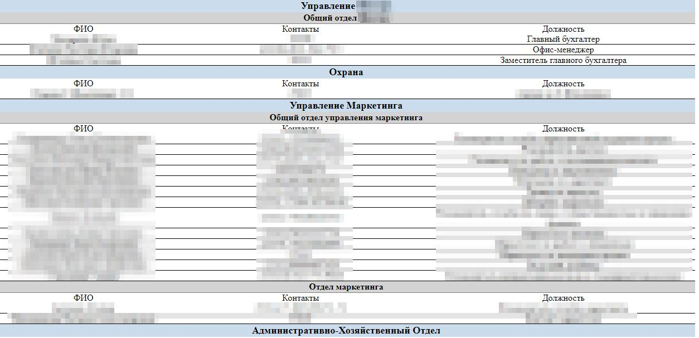

# Emissary - offline телефонный справочник из LDAP
Программа для формирования HTML-телефонного справочника из LDAP для offline использования

  - При создании, используются названия каталогов расположения пользователей
  - Можно выводить только требуемых пользователей/каталоги, используя LDAP фильтры
  - При сборке, можно указать значения по умолчанию

## Ключи программы:
    -b string
      Базовый каталог LDAP для поиска: OU=Users,DC=exa,DC=example,DC=com
    -d string
        Домен для логина пользователя: ex.example.com
    -f string
        LDAP фильтр для поиска пользователей: (objectClass=organizationalPerson)
    -l string
        Имя пользователя для доступа к LDAP
    -o string
        Путь до файла вывода телефонного справочника (default "Emissary.html")
    -p string
        Пароль пользователя для доступа к LDAP
    -s string
        Адрес LDAP сервера в формате: ldap.example.com:389

## Сборка программы
1. Установить [Go 1.18](https://go.dev/doc/install) или воспользоваться [Docker контейнером](https://hub.docker.com/_/golang?tab=tags&page=1&name=1.18)
2. Клонировать данный репозиторий
3. В папке проекта выполнить команды:
- Для Linux/Windows:
    - `go build -v -ldflags "-s -w"`
- При кросплатформеной сборке с Linux на Windows:
  - `GOOS=windows GOARCH=amd64 go build -ldflags "-s -w"`
- При кросплатформеной сборке с Windows на Linux:
  - `$env:GOARCH="amd64"; $env:GOOS="linux"; go build -v -ldflags "-s -w"`
